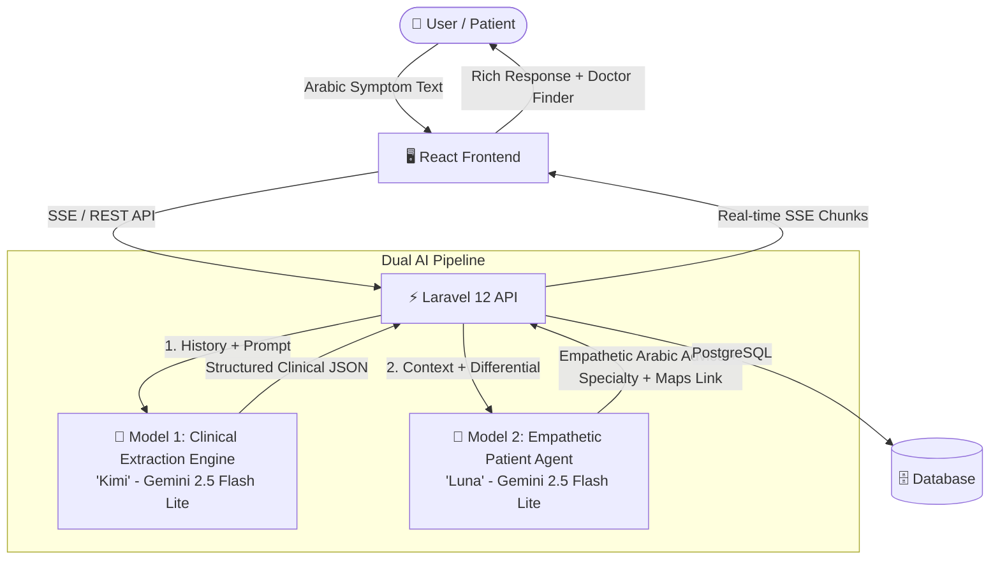

# 🩺 Sehetak-AI (صحتك AI) — AI-Powered Clinical Triage & Medical Navigation System

<div align="center">

[](https://sehetak-ai.pages.dev/)
[](https://aistudio.google.com/)
[](LICENSE)

**An intelligent, multi-turn medical triage assistant that helps patients describe their symptoms in Egyptian Arabic, analyzes emergency red flags, guides them with natural conversation, and routes them to the ideal medical clinic with instant Google Maps provider links.**

[Explore Live Demo](https://sehetak-ai.pages.dev/)

</div>

---

## 📑 Table of Contents

- [📖 Project Overview](#-project-overview)
- [🧠 Dual-Model AI Architecture](#-dual-model-ai-architecture)
- [✨ Key Features](#-key-features)
- [🏗️ System Architecture](#️-system-architecture)
- [💻 Tech Stack](#-tech-stack)
- [📡 RESTful API Reference](#-restful-api-reference)
- [🚀 Quick Start (Local Setup)](#-quick-start-local-setup)
- [☁️ Deployments](#️-deployments)
- [🛡️ Medical Disclaimer](#️-medical-disclaimer)

---

## 📖 Project Overview

**Sehetak-AI (صحتك)** is designed to bridge the gap between initial patient symptom onset and timely medical care. Patients often struggle to know which specialty they should visit when experiencing ambiguous or compound symptoms. 

Unlike generic chatbots, **Sehetak-AI** operates a specialized two-stage clinical pipeline:
1. **Model 1 ("Kimi")**: An invisible clinical reasoning engine that parses free-text Arabic descriptions, normalizes medical terms, scans for emergency red flags, and structures the clinical presentation into JSON.
2. **Model 2 ("Luna")**: A warm, empathetic patient-facing communicator speaking natural Egyptian Arabic. Luna gathers missing patient demographics, comforts the patient, conducts intelligent non-redundant follow-up, and directs them to the right clinic with personalized Google Maps search links.

---

## 🧠 Dual-Model AI Architecture



### 1. Clinical Symptom-Extraction Engine (Kimi)
- **Role**: Backend-only diagnostic reasoning & structuring engine.
- **Output**: Pure JSON containing normalized clinical terms, onset, severity, age group, differential conditions, emergency red flags, and off-topic flag.
- **Context Accumulation**: Retains symptoms across multi-turn history even when patient sends brief acknowledgments (e.g., *"هما نفس الأعراض"* or *"مفيش أعراض تانية"*).

### 2. Patient Guidance & Navigation Agent (Luna)
- **Role**: Patient dialogue agent speaking friendly, colloquial Egyptian Arabic.
- **Behavior**:
  - **Emergency Triage**: Immediate urgent escalation (`urgency: urgent`) if red flags are detected (e.g., severe sudden chest pain, stroke symptoms, uncontrolled bleeding).
  - **Single Specialty Recommendation**: Recommends exactly one clear specialty from 13 supported departments.
  - **Location-Based Search**: Appends an actionable Google Maps search URL tailored to the patient's area (e.g., `دكتور باطنة في الدقي`).
  - **Graceful Off-Topic Handling**: Politely redirects non-medical queries (e.g., trivia, greetings) back to patient well-being.

---

## ✨ Key Features

- **🗣️ Natural Egyptian Dialect**: Converses fluidly and warmly without robotic repetition or stiff translations.
- **🚨 Instant Red-Flag Detection**: Identifies critical emergencies and issues urgent directives to seek emergency care immediately.
- **🗺️ Geolocation & Doctor Finder**: Automatically detects patient city/district and generates direct Google Maps doctor query links.
- **⚡ Real-Time Streaming (SSE)**: Streams AI responses word-by-word via Server-Sent Events with typing indicators.
- **📱 Responsive Mobile-First Design**: Optimized for mobile and desktop with clean medical UI, RTL Arabic support, and dark/light themes.
- **🔐 Secure Token Auth**: User registration, login, and conversation persistence powered by Laravel Sanctum.
- **🛡️ Built-in Rate-Limit Fallback**: Automatic exponential retry preventing API rate limit interruptions on high-traffic turns.

---

## 🏥 Supported Medical Specialties

The AI routes patient cases into 13 distinct clinical departments:

| Department (Arabic) | Specialty Slug | Typical Presenting Symptoms |
|---|---|---|
| **جراحة العظام** | `orthopedics` | Bone fractures, joint sprains, back/neck musculoskeletal pain |
| **الباطنة** | `internal_medicine` | Abdominal cramps, gastroenteritis, chronic hypertension, fatigue |
| **الجلدية** | `dermatology` | Rashes, skin lesions, eczema, allergic hives |
| **العيون** | `ophthalmology` | Eye redness, vision blurring, eye irritation or discharge |
| **القلب** | `cardiology` | Palpitations, chronic chest discomfort, arrhythmias |
| **المخ والأعصاب** | `neurology` | Migraines, neuropathy, numbness, tremors |
| **الأسنان** | `dentistry` | Toothaches, gum swelling, sensitivity to hot/cold |
| **أنف وأذن وحنجرة** | `ent` | Sore throat, ear pain, sinus congestion, hearing issues |
| **الأطفال** | `pediatrics` | Fevers, infant colic, childhood infections |
| **النساء والتوليد** | `gynecology` | Pregnancy follow-up, menstrual irregularities, pelvic pain |
| **المسالك البولية** | `urology` | Burning urination, renal colic, kidney pain |
| **الجراحة العامة** | `general_surgery` | Hernias, acute appendicitis, abscesses |
| **النفسية** | `psychiatry` | Anxiety, depression, insomnia, panic attacks |

---

## 💻 Tech Stack

### Frontend
- **Framework**: React 18 + Vite
- **Styling**: Modern CSS3 (RTL, CSS Variables, Glassmorphism)
- **State & Streaming**: Custom React hooks with `fetch` SSE streaming reader
- **Architecture**: Single Page Application (SPA)

### Backend
- **Framework**: Laravel 12 (PHP 8.2+)
- **Authentication**: Laravel Sanctum (Bearer Tokens)
- **AI Client**: `openai-php/client` configured with Google AI Studio OpenAI-compatible endpoint
- **Database**: PostgreSQL / SQLite

---

## 📡 RESTful API Reference

Base API URL: `https://<your-backend-domain>/api`

### 1. Authentication

| Method | Endpoint | Description | Auth Required |
|---|---|---|---|
| `POST` | `/api/register` | Create account and return token | No |
| `POST` | `/api/login` | Authenticate user and return token | No |
| `POST` | `/api/logout` | Revoke active token | Yes (Bearer) |

#### Register / Login Request Body:
```json
{
  "name": "Ahmed",
  "email": "ahmed@example.com",
  "password": "securepassword123",
  "password_confirmation": "securepassword123"
}
```

### 2. Conversations & Messaging

| Method | Endpoint | Description | Auth Required |
|---|---|---|---|
| `GET` | `/api/conversations` | List user's conversations | Yes (Bearer) |
| `POST` | `/api/conversations` | Create a new conversation session | Yes (Bearer) |
| `GET` | `/api/conversations/{id}` | Retrieve conversation with messages | Yes (Bearer) |
| `DELETE` | `/api/conversations/{id}` | Delete a conversation | Yes (Bearer) |
| `POST` | `/api/messages` | Send initial message (auto-creates conversation) | Yes (Bearer) |
| `POST` | `/api/conversations/{id}/messages` | Send reply message | Yes (Bearer) |

#### Sending a Message (`?stream=1` supported for SSE):
```json
{
  "message": "عندي وجع شديد في أسناني من يومين وساكن في المعادي"
}
```

#### JSON Response Schema:
```json
{
  "conversation": {
    "id": 12,
    "specialty": "dentistry",
    "urgency": "normal",
    "is_complete": true
  },
  "ai_response": {
    "message": "سلامتك، الأعراض دي غالبًا بتحتاج كشف عند دكتور أسنان. ممكن تدور على دكاترة أسنان قريب منك من هنا: https://www.google.com/maps/search/دكتور+الأسنان+في+المعادي",
    "specialty": "dentistry",
    "urgency": "normal",
    "conversation_complete": true,
    "follow_up_questions": []
  }
}
```

---

## 🚀 Quick Start (Local Setup)

### Prerequisites
- PHP 8.2+ with `pdo_sqlite` or `pdo_pgsql`
- Composer 2+
- Node.js 18+ and npm
- A Google AI Studio API Key ([Get one here](https://aistudio.google.com/))

### 1. Clone the Repository
```bash
git clone https://github.com/Eng-MohamedHosny/Ai-Hackathon-Project.git Sehetak-AI
cd Sehetak-AI
```

### 2. Backend Setup
```bash
cd Backend
composer install
cp .env.example .env

# Generate encryption key
php artisan key:generate

# Set up SQLite database
touch database/database.sqlite
php artisan migrate

# Start backend server
php artisan serve --port=8000
```

Configure `Backend/.env`:
```env
APP_NAME=Sehetak-AI
APP_URL=http://localhost:8000
FRONTEND_URL=http://localhost:5173

DB_CONNECTION=sqlite
DB_DATABASE=database/database.sqlite

KIMI_BASE_URL=https://generativelanguage.googleapis.com/v1beta/openai
KIMI_API_KEY=your_google_ai_studio_api_key_here
KIMI_MODEL=gemini-2.5-flash-lite
LUNA_MODEL=gemini-2.5-flash-lite
```

### 3. Frontend Setup
```bash
cd ../Frontend
npm install

# Set local backend URL in .env
echo "VITE_API_BASE_URL=http://localhost:8000/api" > .env

# Launch development server
npm run dev
```
Open your browser at `http://localhost:5173`.

---

## ☁️ Deployments

### 1. Frontend Web App
- **Live Website**: [https://sehetak-ai.pages.dev/](https://sehetak-ai.pages.dev/)

#### Build & Run
1. Build the production bundle:
   ```bash
   cd Frontend
   npm run build
   ```
2. Deploy the output `dist/` directory to any static hosting or cloud edge provider.

### 2. Backend API
1. Configure production environment variables:
   ```env
   APP_ENV=production
   APP_DEBUG=false
   FRONTEND_URL="https://sehetak-ai.pages.dev"
   KIMI_BASE_URL="https://generativelanguage.googleapis.com/v1beta/openai"
   KIMI_API_KEY="your_api_key"
   KIMI_MODEL="gemini-2.5-flash-lite"
   LUNA_MODEL="gemini-2.5-flash-lite"
   ```
2. Run database migrations:
   ```bash
   php artisan migrate --force
   ```

---

## 🛡️ Medical Disclaimer

> [!IMPORTANT]
> **صحتك AI هو رفيق إرشادي وتوجيهي فقط ولا يُعد بديلاً عن التشخيص الطبي المتخصص.**
> **Sehetak-AI is an educational and clinical navigation tool.** It does not provide medical diagnoses, write prescriptions, or offer treatment plans. If you or someone around you is experiencing life-threatening symptoms (e.g., acute chest pressure, sudden numbness/paralysis, severe difficulty breathing, or severe bleeding), immediately call your local emergency service or proceed to the nearest hospital emergency room.

---

## 👨‍💻 Author & Acknowledgements

Developed by **Mohamed Hosny** ([@Eng-MohamedHosny](https://github.com/Eng-MohamedHosny)).

Built for the **AI Hackathon 2026**. Special thanks to Google DeepMind and Google Cloud for powering next-generation healthcare agentic workflows.
